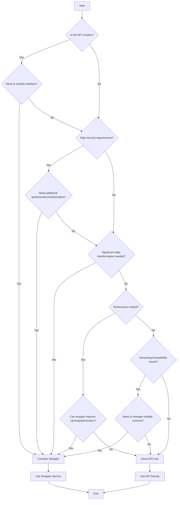

# Decision Tree: Should an API Use a Wrapper Service?

## Decision Points Explanation

1. **API Complexity**: If the API is complex, a wrapper might help simplify its usage.
2. **Security Requirements**: High security needs might require additional layers provided by a wrapper.
3. **Data Transformation**: Significant data transformation might be better handled in a wrapper service.
4. **Performance**: If performance is critical, consider if a wrapper can provide optimizations like caching.
5. **Versioning and Compatibility**: Wrappers can help manage multiple API versions or backward compatibility.

## Conclusion

Use this decision tree to guide the decision on whether to implement a wrapper service for an API. Consider the specific needs and constraints of your project when making the final decision.
